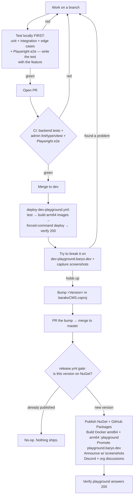

# AI Development Lifecycle

How barakoCMS is built and shipped. The code is written with an AI pair (Claude Code), but the
process around it is deliberately engineered: nothing reaches users because a model felt confident.
Every change passes tests, deploys to a breakable tier first, and is verified running before it is
promoted. This document describes that loop so a contributor — human or agent — knows where a change
goes and what has to be true before it moves forward.

## Principle: the AI writes, the process proves

An agent is good at producing plausible code quickly. Plausible is not the same as correct. The
whole lifecycle exists to close that gap:

- **Tests gate every promotion.** Not "the model says it's fine" — the suite runs, and a red suite
  stops the pipeline.
- **A breakable tier absorbs the mistakes.** New builds land on dev-playground first, on an empty
  database, where breaking things is the point. Only after that do they touch anything users see.
- **Deploys are verified, not assumed.** Each deploy ends by fetching the live URL and failing if it
  doesn't answer 200. "It deployed" means the site responded, not that a job turned green.
- **Findings are checked against the running system.** A claim like "fresh installs boot" is proven
  by wiping a database and watching login succeed, not by reading the diff.

That last point is not hypothetical. The `AutoCreate.None` setting looked correct in review and
passed on every existing environment — because they already had their schema. Standing up
dev-playground on an empty database is what surfaced the crash (`relation "mt_doc_roles" does not
exist`) before a single real user hit it. The breakable tier earned its keep on its first day.

## The environments

| Tier | URL | Purpose | Deploy |
|---|---|---|---|
| **dev-playground** | dev-playground.baryo.dev | Breakable staging. Break it freely. | Auto on every push to `dev` |
| **playground** | playground.baryo.dev | Public demo. Runs released versions only. | Auto on a version-gated master release |
| **club** | club.baryo.dev | Real members. | By hand, on purpose — separate blast radius |

The club is deployed manually and is never part of the automated pipeline. It has real people on it,
so it does not share a failure mode with a showcase site.

## The loop

### 0. Test locally first — before anything leaves the machine

The first gate is the developer's own machine, not CI. Every change is proven locally before its
branch is pushed:

- **Unit + integration tests** for the logic (`dotnet test`) — including the **edge cases**, not just
  the happy path. A new field type ships with tests for the malformed value, the boundary, the alias,
  the empty input.
- **Playwright end-to-end** for anything with a UI — written *with* the feature, in the same change,
  driving the real components. The e2e mirrors what the feature actually does: for the field-types
  work, that meant a spec asserting each type renders the right control, a valid entry saves, and a
  malformed value surfaces the server's validation error.

The rule: **the same behaviour you'll later verify by hand on dev-playground, you first pin down in a
test locally.** If it can't pass on your machine, it has no business going near a deployed tier. CI
then re-runs all of it as a backstop — but green CI is confirmation, not the first discovery.

### 1. Branch and PR

Work happens on a branch. Every PR runs CI: the .NET test suite, the admin's lint / type-check /
unit tests, and the Playwright e2e pack — the same tests that already passed locally in step 0. A red
check blocks the merge. This is the same gate whether the author is a person or an agent.

### 2. Merge to `dev` → dev-playground

A push to `dev` triggers `deploy-dev-playground.yml`:

1. Run the full test suite again (a merge is not a PR, so re-verify rather than assume).
2. Build the `:dev` suite and admin images natively on an arm64 runner — the Oracle Ampere VM is
   arm64, so this avoids slow QEMU emulation.
3. Deploy over SSH using a **forced-command key**: the key in the VM's `authorized_keys` can only run
   `/home/opc/deploy-dev-playground.sh` and nothing else, so a leaked CI key cannot open a shell.
   The script pulls both images, recreates the stack, and fails unless the API and admin both
   answer 200.
4. The workflow then fetches the public URL and fails if dev-playground isn't serving 200.

Now break it. This is the tier where a broken build is acceptable and expected.

### 3. Bump the version → master → release

The single source of truth for a release is `<Version>` in `barakoCMS/barakoCMS.csproj`:

- **Bump it** in a PR, and merging to master publishes that version and promotes it to the
  playground.
- **Leave it unchanged**, and the master merge is a no-op — the gate sees the version is already on
  NuGet and stops.

There is no auto-bumping. A merge never publishes by surprise, and a published version's Docker tags
are never overwritten with different bits. To ship, you bump the version. That is the entire
release ritual.

When the version is new, `release.yml` runs:

1. **Gate** — read the version, check NuGet, decide whether there's anything to release.
2. **Test** — the suite, once more.
3. **Publish** — core + 11 modules to NuGet.org and GitHub Packages; Docker images
   (`barako-cms`, `barako-cms-decaf`, `barako-admin`) as amd64 for public consumers, mirrored to
   Docker Hub.
4. **Build arm64 playground images** — native `:playground` images on an arm64 runner, so the VM
   runs them directly instead of under emulation.
5. **Deploy** — the same forced-command pattern promotes the full stack to playground.baryo.dev and
   verifies 200.
6. **Announce** — the release is posted to the org discussions and Discord, **with screenshots** of
   what shipped when there's something visual to show. A release notes line is easy to skim past; a
   picture of the new field-type picker or the entry form makes the change real. Screenshots are
   captured with Playwright (the same tool the e2e already uses) against dev-playground before the
   promotion, so the shot is of the exact build being released. Best-effort: a failed announcement
   never turns a successful release red.

## Where the human decides

The pipeline is automated; the judgment is not. A person (not the agent) decides:

- **When to cut a release** — by choosing to bump the version. Publishing to NuGet is irreversible
  and outward-facing, so it is a deliberate act, never a side effect of merging.
- **What "stable enough" means** on dev-playground before promotion.
- **Anything touching the club**, which stays manual by design.

The agent's job is to make each of those decisions cheap and safe to act on: fast feedback, honest
verification, and a breakable tier that catches the mistakes before they matter.

## Rollback

- **Playground**: re-tag a previous `playground-<version>` image to `:playground` and re-run the
  deploy, or point the compose file back at the prior image and recreate.
- **Packages**: NuGet versions are immutable and cannot be unpublished cleanly — this is exactly why
  publishing is gated behind a deliberate version bump rather than automatic on every merge. The fix
  for a bad release is a new, higher version, not an undo.
