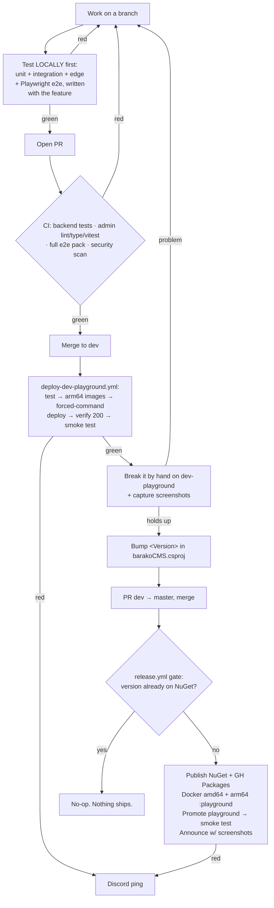

# AI Development Lifecycle

How barakoCMS is built and shipped. The code is written with an AI pair (Claude Code), but the
process around it is deliberately engineered: nothing reaches users because a model felt confident.
Every change is proven locally, gated by CI, deployed to a breakable tier, and verified running
before it is promoted.

This doc is the **playbook**. If you (person or agent) are about to build the next feature, follow
the checklist in "Shipping a feature, step by step" and use the rest as reference.

## Principle: the AI writes, the process proves

An agent produces plausible code quickly. Plausible is not correct. The lifecycle closes that gap:

- **Tests gate every promotion.** Not "the model says it's fine" — the suite runs, red stops the line.
- **Prove it locally first.** Unit + integration + e2e run on your machine before the branch is
  pushed. CI is the backstop, not the first discovery.
- **A breakable tier absorbs mistakes.** New builds land on dev-playground first, on an empty
  database, where breaking things is the point. Only then do they touch anything users see.
- **Deploys are verified, not assumed.** After every deploy a smoke test logs in, creates content,
  and checks validation still rejects bad input. "It deployed" means the app worked, not that a job
  went green.

That last point is not hypothetical. `AutoCreate.None` looked correct in review and passed on every
existing environment — because they already had schema. Standing up dev-playground on an empty
database is what surfaced the boot crash (`relation "mt_doc_roles" does not exist`) before a real
user hit it. Writing the field-types e2e is what surfaced a dashboard crash on partial metrics data.
The process finds the bugs; that is the point of it.

## Production-readiness review

A generated endpoint compiles, returns 200, and looks complete. That is where the review starts, not
where it ends. "Working" and "production-ready" are different claims, and the gap is always the same
short list of things the first draft leaves out. Every change runs against this checklist — some by an
adversarial review sub-agent, some by tests, some by a human looking at the real artifact.

| What the draft usually omits | How we catch it | Caught here, for real |
| --- | --- | --- |
| Input validation | A FluentValidation validator plus a test that sends bad input and asserts it is rejected | Weak/empty/duplicate inputs are explicit test cases (menu dup-slug, change-password weak/empty/same) |
| Authorization | An adversarial review that asks "can another user / a non-admin reach this?" and abuse-case tests | The change-password review verified no cross-user targeting and that the SuperAdmin gate is real |
| Transactions / partial state | One atomic `SaveChangesAsync`; the review asks what happens if it throws mid-way | The refresh-token revocation is all-or-nothing; a concurrency failure leaves nothing half-written |
| Fail-closed defaults | Allowlist, never denylist, for anything user-facing | Public delivery moved from denylist to allowlist after review found two ways fields could leak |
| Exception handling | The review looks for the swallowed error and the 500 that leaks state | The API-key touch race and the SVG stored-XSS were both sub-threshold review notes, hardened anyway |
| Schema / migration safety | A breakable tier on an empty database, before anything users see | The GIN index crash-looped boot under `CreateOnly`; dev-playground caught it, not review |
| Rate limiting, logging, caching | Present in the platform, checked as part of review, not assumed | Public reads are `Cache-Control`d; auth endpoints are throttled; Serilog is structured |
| The thing actually rendering | A human looks at the live page/DOM/API response, not the status code | A stale service worker, an empty docs sidebar, and leaked VitePress markup all passed `200` and only showed up on screen |

Two rules hold the checklist together:

- **A 200 is not a pass.** "It deployed" and "the endpoint answers" are the beginning of verification.
  Look at what the user actually gets: the rendered DOM, the JSON body, the tenant the data came from.
  Several real bugs this project shipped past HTTP 200 and were only caught by looking.
- **Review adversarially, and write the abuse case as a test.** A finding that is not pinned by a
  test comes back. Every security-sensitive change gets a sub-agent whose job is to break it, and its
  confirmed findings become tests before the change merges.

## The environments

| Tier | URL | Purpose | Deploy trigger |
|---|---|---|---|
| **dev-playground** | dev-playground.baryo.dev | Breakable staging. Break it freely. | Push to `dev` |
| **playground** | playground.baryo.dev | Public demo. Released versions only. | Version-gated `master` release |
| **production** | (private) | Real user data. | By hand, on purpose |

Production is never in the automated pipeline — real people, separate blast radius. Do not wire it in.

## The loop



## Shipping a feature, step by step

A checklist. The field-types feature (F.1/F.2) is the worked example throughout.

### 0. Build it with its tests, and prove them locally

Write the feature and its tests together, then run everything on your machine. Nothing is pushed
until this is green.

- **Backend unit tests** for the logic, edge cases included — malformed input, boundaries, aliases,
  empty values. Example: `FieldTypeRegistryTests` checks each new type's format, the parity between
  validators, and JsonElement handling.
- **Backend integration tests** for the API path, against a real Postgres (Testcontainers) — no
  mocking your own layer. Example: `ValidationIntegrationTests` posts to the real `/api/content-types`
  and `/api/contents`, asserting a valid value is accepted (200) and a malformed one rejected (400).
- **Admin e2e (Playwright)** for anything with a UI, driving the real components with a mocked API.
  Example: `field-types.spec.ts` asserts each type renders the right control, a valid entry saves,
  and a bad value surfaces the server error.

```bash
# backend (unit + integration; Testcontainers needs Docker running)
dotnet test BarakoCMS.Tests/BarakoCMS.Tests.csproj -c Release

# admin
cd admin && npm run lint && npx tsc --noEmit && npx vitest run
npx playwright test                 # full pack, all viewports
```

Rule of thumb: **whatever you'll later verify by hand on dev-playground, pin it in a test first.**

#### Security-sensitive changes get an extra gate

A change is security-sensitive when it touches **authentication, tokens, permissions, tenancy,
secrets, or crypto**, OR when it **exposes data anonymously or publicly**: a new unauthenticated
endpoint, or any change to which fields or documents leave the API. That last trigger is easy to miss
because it isn't "auth" in the usual sense, but the public content delivery API was exactly this, and
the review caught two high-severity data leaks in it. If a change widens what an untrusted caller can
read, it gets this gate. Functional tests aren't enough here; they prove it works, not that it can't
be abused. These changes additionally require:

- **Abuse-case tests, not just edge cases.** Write them from an attacker's seat: a forged or expired
  credential, a revoked one still being used, a scope escalation, a request crossing into another
  tenant, a draft or a sensitive field reaching an anonymous caller. The H.1 token fix is the
  cautionary tale, where a test "passed" on a rate-limit 429 without ever exercising the check. Assert
  on the *merits* (the actual rejection reason or the exact field that must be absent), never just a
  non-200.
- **Fail closed, allowlist not denylist.** For anything that decides what data leaves the API, start
  from nothing and add back only what is explicitly allowed. A denylist ("return everything, then
  strip the sensitive parts") leaks the moment something new appears that the strip step doesn't know
  about. The public delivery review found exactly this: a field-stripping denylist leaked orphan and
  mis-cased keys, and the fix was to emit only fields the schema marks Public.
- **An adversarial review before merge.** Run `/security-review` on the diff and act on what it finds.
  A second, skeptical pass catches what the author's mental model misses. It has earned its place:
  every security-sensitive feature so far (the API-key revocation race, the public delivery leaks) had
  a real, shippable bug that this pass caught and no functional test would have.
- **SAST clean.** CodeQL (`codeql.yml`) scans every PR for code-level flaws: injection, auth-logic
  bugs, unsafe deserialization. Read its findings on the PR, don't just let them sit in the Security
  tab.

The principle from the top of this doc applies double here. The AI writes the code, but the process,
abuse tests plus fail-closed design plus adversarial review plus SAST, is what earns the right to
ship it.

### 1. Branch, PR, CI

Work on a branch off `dev`. Push it and open a PR. CI (`ci.yml`) runs on every push (except master)
and every PR:

- **Backend** — build + full `dotnet test` (Testcontainers Postgres).
- **Admin** — lint, typecheck, vitest, production build, and the **whole e2e folder** on chromium.
- **Security** — gitleaks secret scan + a vulnerable-dependency report (both report-only for now;
  see the security note below).

Red blocks the merge (the security job is informational until its backlogs are cleared). It is the same gate for a person or an agent. These are the same tests that
already passed locally — CI confirms, it does not discover.

### 2. Merge to `dev` → dev-playground

Merging to `dev` triggers `deploy-dev-playground.yml`:

1. Run the test suite again (a merge is not a PR).
2. Build `:dev` suite + admin images natively on an arm64 runner (the Ampere VM is arm64; no QEMU).
3. Deploy over SSH with a **forced-command key** — the key in `authorized_keys` can only run
   `/home/opc/deploy-dev-playground.sh`, nothing else, so a leaked key can't open a shell. The script
   pulls both images, recreates the stack, and fails unless API and admin answer 200.
4. **Smoke test** (`scripts/smoke-test.sh`, write tier): log in, create a content type, post a valid
   value and a malformed one, confirm validation still rejects the bad one. A 200 means "up"; the
   smoke means "actually works."
5. If any of this fails, Discord gets pinged.

Then break it by hand on dev-playground. This is the tier where a broken build is fine.

### 3. Verify + capture screenshots

Confirm the feature does what you claimed, on the live tier. Capture screenshots for the
announcement while you're there:

```bash
cd admin && npx playwright test screenshots.spec.ts --project=chromium
# → admin/test-results/screenshots/*.png
```

### 4. Bump the version → PR to `master` → release

The single source of truth for a release is `<Version>` in `barakoCMS/barakoCMS.csproj`:

- **Bump it** in the PR — merging to master publishes that version and promotes it to playground.
- **Leave it unchanged** — the master merge is a no-op; the gate sees the version is already on
  NuGet and stops.

No auto-bumping. A merge never publishes by surprise, and a published version's Docker tags are never
overwritten with different bits. **To ship, bump the version.** Update `CHANGELOG.md` in the same PR.

Open the PR from `dev` to `master` and merge it with a **merge commit** (not squash — `dev` is
long-lived; see Branch model). When the version is new, `release.yml`:

1. **Gate** — read the version, check NuGet, decide if there's anything to release.
2. **Test** — the suite, once more.
3. **Publish** — core + 11 modules to NuGet.org and GitHub Packages; Docker images
   (`barako-cms`, `barako-cms-decaf`, `barako-admin`) as amd64 for public users, mirrored to Docker Hub.
4. **Build arm64 `:playground` images** on an arm64 runner, so the VM runs them natively.
5. **Deploy** the full stack to playground via forced command, verify 200, then a read-only smoke
   test (no writes on the public demo).
6. **Announce** to org discussions + Discord, with screenshots when there's something visual.
7. If anything fails, Discord gets pinged.

## What CI runs (`ci.yml`)

- **backend**: `dotnet build` + `dotnet test` (unit + integration, real Postgres).
- **admin**: lint, `tsc --noEmit`, vitest, `next build`, and `playwright test --project=chromium`
  over the **whole** `e2e/` folder — every feature spec is enforced, not honour-checked.
- **security**: gitleaks secret scan + `dotnet list package --vulnerable`. Both report-only for now —
  dev-only secrets still live in git history (roadmap 0.4) and there's a dependency backlog to burn
  down. Flip gitleaks to a hard gate once history is scrubbed.

## Post-deploy smoke test (`scripts/smoke-test.sh`)

Runs after every deploy. Tiers, each gated on the previous:

1. Always — `/health` and `/api/content-types` return 200 (app up, DB reachable).
2. With `SMOKE_USER`/`SMOKE_PASS` — login returns a token (auth works).
3. With `SMOKE_WRITE=1` — create a content type with an email field, post a valid entry (200) and a
   malformed one (400). **Write tier only where test data is fine (dev-playground), never the public
   demo.** The release runs the read-only tiers against playground.

```bash
SMOKE_USER=dev_admin SMOKE_PASS=… SMOKE_WRITE=1 \
  bash scripts/smoke-test.sh https://dev-playground.baryo.dev/barakocms-api
```

## Rollback

Every release pushes immutable `:playground-<version>` images. To roll back, run the **Rollback
playground** workflow (`rollback-playground.yml`) with the target version — it repoints the moving
`:playground` tag at that version (no rebuild), redeploys, and smoke-tests. Boring and fast.

NuGet versions are immutable and can't be cleanly unpublished — which is *why* publishing is gated
behind a deliberate version bump. The fix for a bad package release is a new, higher version.

## Branch model

- `dev` is **long-lived**. Feature branches merge into it; it auto-deploys to dev-playground.
- Release = a `dev → master` PR merged with a **merge commit**, then sync `dev` back so the next
  cycle starts aligned:

  ```bash
  git checkout master && git pull
  git checkout dev && git merge master && git push   # keep dev == master
  ```

- Never squash `dev → master` (it diverges the two branches). Squash is fine for a feature branch
  into `dev`.

## Where the human decides

The pipeline is automated; the judgment is not. A person, not the agent, decides:

- **When to cut a release** — by bumping the version. Publishing to NuGet is irreversible and
  outward-facing, so it is deliberate, never a side effect of merging.
- **What "stable enough" means** on dev-playground before promotion.
- **Anything touching the club.**

The agent's job is to make each of those cheap and safe to act on: fast local feedback, honest
verification, a breakable tier, and a one-button rollback.
