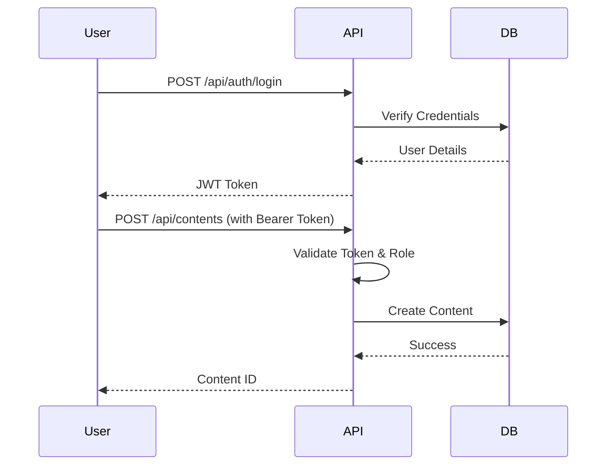
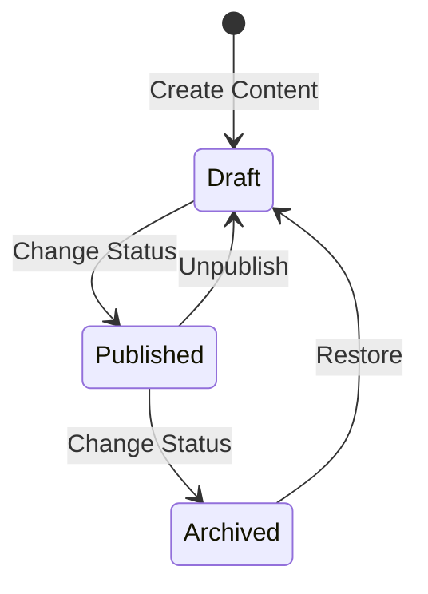

# BarakoCMS

A modern, headless CMS built with .NET 8, FastEndpoints, and MartenDB (PostgreSQL).

## Features

- **Headless Architecture**: API-first design for flexibility.
- **High Performance**: Built on [FastEndpoints](https://fast-endpoints.com/) for minimal overhead.
- **Document Database**: Uses [MartenDB](https://martendb.io/) on top of PostgreSQL for flexible content storage.
- **Event Sourcing**: Content changes are versioned using Event Sourcing, providing a full audit trail and history.
- **Content Workflow**: Built-in Draft, Published, and Archived statuses.
- **Authentication**: Built-in JWT Authentication with Role-Based Access Control (RBAC).
- **Swagger UI**: Interactive API documentation.

## Prerequisites

- [.NET 8 SDK](https://dotnet.microsoft.com/download/dotnet/8.0)
- [Docker](https://www.docker.com/) (for PostgreSQL) or a running PostgreSQL instance.

## Setup Guide

### 1. Database Setup

Run a PostgreSQL container:

```bash
docker run --name barako-postgres -e POSTGRES_PASSWORD=postgres -p 5432:5432 -d postgres
```

### 2. Configuration

Update `appsettings.json` with your database connection and JWT key:

```json
{
  "ConnectionStrings": {
    "DefaultConnection": "Host=localhost;Database=barako_cms;Username=postgres;Password=postgres"
  },
  "JWT": {
    "Key": "your-super-secret-key-that-is-at-least-32-chars-long"
  },
  "InitialAdmin": {
    "Username": "admin",
    "Password": "SecurePassword123!"
  }
}
```

### 3. Run Application

```bash
dotnet run --project barakoCMS
```

Access Swagger UI at `http://localhost:5000/swagger`.

## Usage & Workflows

### Authentication Flow



### Content Creation & Workflow



## API Reference (cURL Examples)

### 1. Login

```bash
curl -X POST "http://localhost:5000/api/auth/login" \
  -H "Content-Type: application/json" \
  -d '{
    "username": "admin",
    "password": "SecurePassword123!"
  }'
```

**Response:**
```json
{
  "token": "eyJhbGciOiJIUzI1Ni...",
  "expiry": "2023-12-01T12:00:00Z"
}
```

### 2. Create Content Type

```bash
curl -X POST "http://localhost:5000/api/content-types" \
  -H "Authorization: Bearer <YOUR_TOKEN>" \
  -H "Content-Type: application/json" \
  -d '{
    "name": "Article",
    "fields": {
      "title": "string",
      "body": "richtext",
      "tags": "array"
    }
  }'
```

### 3. Create Content (Draft)

```bash
curl -X POST "http://localhost:5000/api/contents" \
  -H "Authorization: Bearer <YOUR_TOKEN>" \
  -H "Content-Type: application/json" \
  -d '{
    "contentType": "Article",
    "data": {
      "title": "My First Article",
      "body": "Hello World",
      "tags": ["news", "tech"]
    },
    "status": "Draft"
  }'
```

### 4. Change Status (Publish)

```bash
curl -X PUT "http://localhost:5000/api/contents/{CONTENT_ID}/status" \
  -H "Authorization: Bearer <YOUR_TOKEN>" \
  -H "Content-Type: application/json" \
  -d '{
    "id": "{CONTENT_ID}",
    "newStatus": "Published"
  }'
```

### 5. Get Content

```bash
curl -X GET "http://localhost:5000/api/contents/{CONTENT_ID}"
```

## Deployment

### Publish to NuGet

To publish this package to NuGet, use the provided script or the dotnet CLI.

```bash
./publish_nuget.sh
```

Or manually:

```bash
dotnet pack -c Release
dotnet nuget push barakoCMS/bin/Release/BarakoCMS.1.0.0.nupkg --source https://api.nuget.org/v3/index.json --api-key <YOUR_API_KEY>
```
