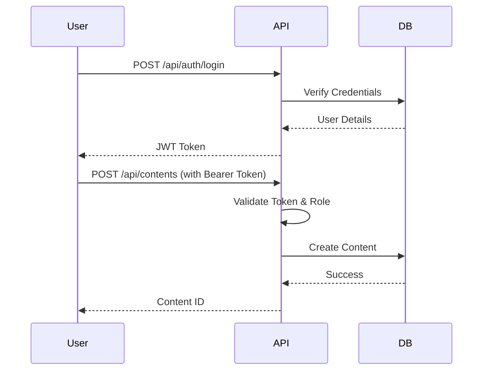
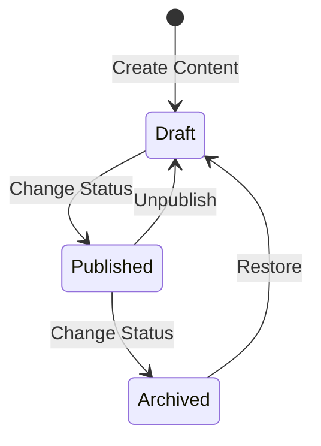

# BarakoCMS

A modern, headless CMS built with .NET 8, FastEndpoints, and MartenDB (PostgreSQL).

## Why BarakoCMS?

- **🚀 AI-Native Ready**: Includes `llms.txt` and `.cursorrules` out of the box, making it the perfect baseline for AI agents and "vibe coding".
- **⚡ High Performance**: Built on [FastEndpoints](https://fast-endpoints.com/) for minimal overhead.
- **📄 Document Database**: Uses [MartenDB](https://martendb.io/) on top of PostgreSQL for flexible content storage.
- **📜 Event Sourcing**: Content changes are versioned using Event Sourcing, providing a full audit trail and history.
- **🔒 Secure**: Built-in JWT Authentication with Role-Based Access Control (RBAC).

## Community & AI

BarakoCMS is designed to be friendly to both human developers and AI agents.

- **For Humans**: Check out our [Contribution Guidelines](CONTRIBUTING.md) and [Code of Conduct](CODE_OF_CONDUCT.md).
- **For AI Agents**: We provide `llms.txt` for context and `.cursorrules` for coding standards. Please cite us using `CITATIONS.cff`.

## License

BarakoCMS is licensed under the **Apache License 2.0**.
- ✅ **Commercial Use Allowed**
- ✅ **Modification Allowed**
- ✅ **Distribution Allowed**
- 📝 **Attribution Required**

See [LICENSE](LICENSE) for full terms.

## Using as a NuGet Package

### 1. Installation

```bash
dotnet add package BarakoCMS
```

### 2. Registration

In your `Program.cs`:

```csharp
using barakoCMS.Extensions;

var builder = WebApplication.CreateBuilder(args);

// Register BarakoCMS services
builder.Services.AddBarakoCMS(builder.Configuration);

var app = builder.Build();

// Use BarakoCMS middleware
app.UseBarakoCMS();

app.Run();
```

### 3. Configuration

Ensure your `appsettings.json` has the required configuration:

```json
{
  "ConnectionStrings": {
    "DefaultConnection": "Host=localhost;Database=barako_cms;Username=postgres;Password=postgres"
  },
  "JWT": {
    "Key": "your-super-secret-key-that-is-at-least-32-chars-long"
  }
}
```

## Prerequisites

- [.NET 8 SDK](https://dotnet.microsoft.com/download/dotnet/8.0)
- [Docker](https://www.docker.com/) (for PostgreSQL) or a running PostgreSQL instance.

## Setup Guide

### 1. Database Setup

Start PostgreSQL using Docker Compose:

```bash
docker compose up -d
# Or if using older Docker Compose v1:
# docker-compose up -d
```

This will start a PostgreSQL container with the database `barako_cms` already created.

To stop the database:

```bash
docker compose down
# Or: docker-compose down
```

### 2. Configuration

Update `appsettings.json` with your database connection and JWT key:

```json
{
  "ConnectionStrings": {
    "DefaultConnection": "Host=localhost;Database=barako_cms;Username=postgres;Password=postgres"
  },
  "JWT": {
    "Key": "your-super-secret-key-that-is-at-least-32-chars-long"
  },
  "InitialAdmin": {
    "Username": "admin",
    "Password": "SecurePassword123!"
  }
}
```

### 3. Run Application

```bash
dotnet run --project barakoCMS
```

Access Swagger UI at `http://localhost:5000/swagger`.

## Manual Installation (No Docker)

If you prefer to install dependencies manually or cannot use Docker:

### 1. Install PostgreSQL
- Download and install [PostgreSQL 16+](https://www.postgresql.org/download/).
- During installation, set the password for the `postgres` user (e.g., `postgres`).
- Create a new database named `barako_cms` using pgAdmin or CLI:
  ```bash
  createdb -U postgres barako_cms
  ```

### 2. Configure Application
- Open `barakoCMS/appsettings.json`.
- Update the `ConnectionStrings:DefaultConnection` to match your local PostgreSQL credentials:
  ```json
  "DefaultConnection": "Host=localhost;Database=barako_cms;Username=postgres;Password=YOUR_PASSWORD"
  ```

### 3. Run
```bash
dotnet run --project barakoCMS
```

## Troubleshooting

### Database Connection Failed
- **Error**: `Npgsql.NpgsqlException: Failed to connect to [::1]:5432`
- **Fix**: Ensure PostgreSQL is running. If using Docker, run `docker compose up -d`. If manual, check your service status.
- **Fix**: Check `appsettings.json` connection string.

### Migration/Schema Issues
- **Error**: `Marten.Exceptions.MartenSchemaException`
- **Fix**: Marten automatically applies schema changes in development. In production, ensure the database user has `CREATE TABLE` permissions or run schema migrations manually.

### Port Conflicts
- **Error**: `IOException: Failed to bind to address http://localhost:5000`
- **Fix**: Another process is using port 5000. Change the port in `Properties/launchSettings.json` or kill the conflicting process.

## Changelog

See [CHANGELOG.md](CHANGELOG.md) for version history.

## Usage & Workflows

### Authentication Flow



### Content Creation & Workflow



## API Reference (cURL Examples)

### 1. Login

```bash
curl -X POST "http://localhost:5000/api/auth/login" \
  -H "Content-Type: application/json" \
  -d '{
    "username": "admin",
    "password": "SecurePassword123!"
  }'
```

**Response:**
```json
{
  "token": "eyJhbGciOiJIUzI1Ni...",
  "expiry": "2023-12-01T12:00:00Z"
}
```

### 2. Create Content Type

```bash
curl -X POST "http://localhost:5000/api/content-types" \
  -H "Authorization: Bearer <YOUR_TOKEN>" \
  -H "Content-Type: application/json" \
  -d '{
    "name": "Article",
    "fields": {
      "title": "string",
      "body": "richtext",
      "tags": "array"
    }
  }'
```

### 3. Create Content (Draft)

```bash
curl -X POST "http://localhost:5000/api/contents" \
  -H "Authorization: Bearer <YOUR_TOKEN>" \
  -H "Content-Type: application/json" \
  -d '{
    "contentType": "Article",
    "data": {
      "title": "My First Article",
      "body": "Hello World",
      "tags": ["news", "tech"]
    },
    "status": "Draft"
  }'
```

### 4. Change Status (Publish)

```bash
curl -X PUT "http://localhost:5000/api/contents/{CONTENT_ID}/status" \
  -H "Authorization: Bearer <YOUR_TOKEN>" \
  -H "Content-Type: application/json" \
  -d '{
    "id": "{CONTENT_ID}",
    "newStatus": "Published"
  }'
```

### 5. Get Content

```bash
curl -X GET "http://localhost:5000/api/contents/{CONTENT_ID}"
```

