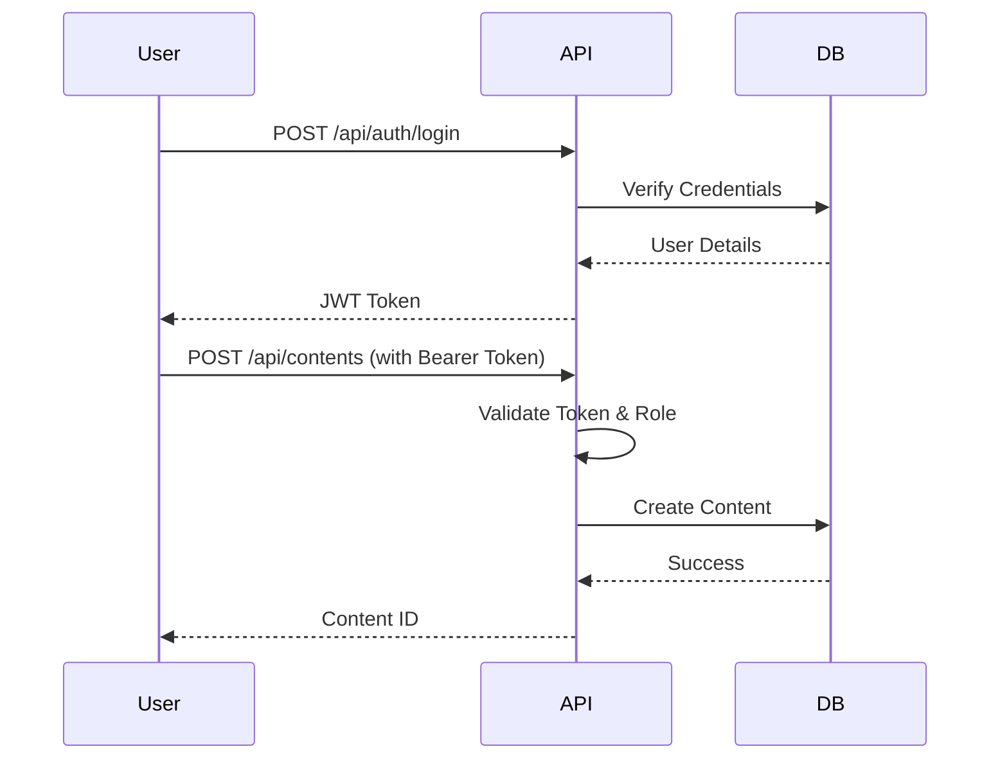
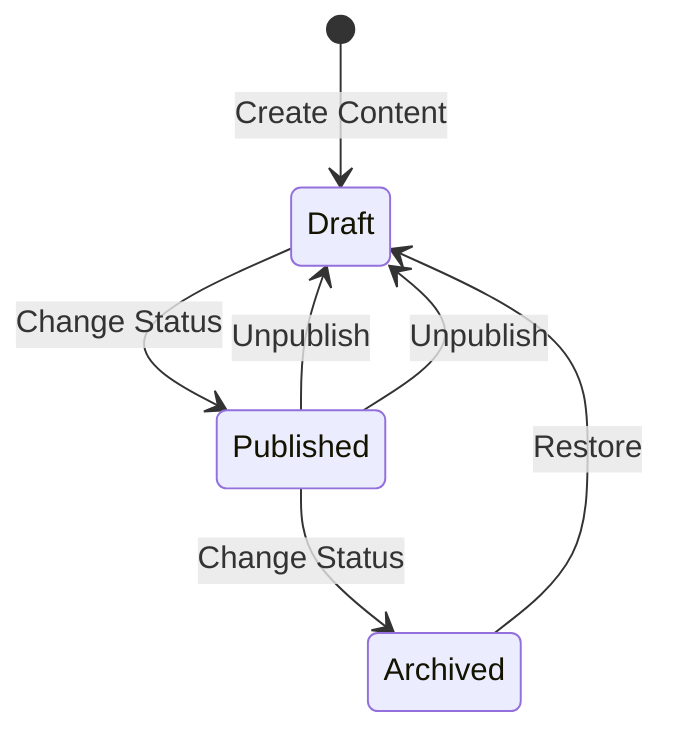

# BarakoCMS

**The AI-Native, High-Performance Headless CMS for .NET 8.**

BarakoCMS is engineered for **Speed**, **Extensibility**, and **Robustness**. Built on the bleeding edge with [FastEndpoints](https://fast-endpoints.com/) and [MartenDB](https://martendb.io/), it delivers a developer-first experience that is both human-friendly and agent-ready.

## 🐛 Bugs Fixed & Changelog (Developer's Log)
- **[Feature] Field-Level Sensitivity**: Implemented `ISensitivityService` to support field-level masking (e.g., hiding SSN, masking BirthDay) for `AttendanceRecord` content type.
- **[Fix] Seeder Configuration**: Updated `Seeder.cs` to correctly use `WebApplication` type.
- **[Fix] Test Infrastructure**: Implemented `CustomWebApplicationFactory` to support Testcontainers for POC tests.
- **[Fix] Authorization**: Updated `Get` endpoint to use `ISensitivityService` for robust data protection.

## 🚀 What's New in v1.1
- **[Architecture] Decoupled Sensitivity**: The `AttendanceRecord` logic has been moved out of the core library into the `AttendancePOC` project, making `barakoCMS` fully generic.
- **[Security] Configurable Policies**: Sensitivity rules (e.g., which roles can see SSN) are now defined in `appsettings.json` instead of hardcoded C#.
- **[Performance] Lightweight Sessions**: Marten now uses lightweight sessions by default, significantly reducing memory usage for high-concurrency scenarios.

## 🧪 Attendance POC (Real-World Example)
Want to see BarakoCMS in action? We've included a fully functional **Attendance System POC**.

### Features
- **Sensitive Data**: Handles SSN (Hidden) and BirthDay (Masked).
- **RBAC**: Different views for `SuperAdmin`, `HR`, and `Standard` users.
- **Workflows**: Automatically sends emails (simulated) upon submission.

### How to Run
1.  **Navigate to the POC directory**:
    ```bash
    cd AttendancePOC
    ```
2.  **Run the application**:
    ```bash
    dotnet run
    ```
3.  **Explore**:
    -   The POC runs on the same port as the main app (default 5000).
    -   It seeds sample data automatically.
    -   Try `GET /api/contents` with different user tokens (see `Seeder.cs` for credentials).

## ✅ Test Coverage (QA's Log)
- **AttendancePOC.Tests**:
    - `SubmitAttendance_ShouldTriggerWorkflow`: **PASSED** (Verifies data submission and workflow trigger).
    - `GetAttendance_ShouldMaskSensitiveData_ForNonSuperAdmin`: **PASSED** (Verifies SSN is hidden and BirthDay is masked for Standard users).
    - `GetAttendance_ShouldReturnAllData_ForSuperAdmin`: **PASSED** (Verifies SuperAdmin can see all sensitive data).
    - `CreateAttendance_ShouldFail_ForAnonymousUser`: **PASSED** (Verifies unauthorized users cannot create records).

## 🌟 Key Features

### ⚡ Unmatched Speed
- **Minimal Overhead**: Powered by FastEndpoints, avoiding the bloat of traditional MVC controllers.
- **Optimized Data Access**: Uses MartenDB (PostgreSQL) for blazing-fast JSON document storage and retrieval.
- **Efficient Caching**: Built-in support for caching strategies to minimize database hits.

### 🧩 Infinite Extensibility
- **Plugin Architecture**: Easily swap out core services like `IEmailService` and `ISmsService` with your preferred providers (SendGrid, Twilio, etc.).
- **Workflow Engine**: A powerful, event-driven workflow engine that lets you define custom triggers and actions (e.g., "Send Email when Order is Created").
- **Custom Content Types**: Define any content structure you need on the fly without schema migrations.

### 🛡️ Enterprise-Grade Robustness
- **Event Sourcing**: Every change is an event. Travel back in time with built-in **Versioning** and **Rollback** capabilities.
- **Idempotency**: Built-in protection against duplicate requests, ensuring data integrity even in flaky network conditions.
- **Role-Based Access Control (RBAC)**: Granular permission management with support for User Groups and Roles.
- **Sensitive Data Protection**: Field-level sensitivity settings (`Public`, `Sensitive`, `Hidden`) to ensure the right data reaches the right users.

### 🚀 AI-Native Design
- **Context-Aware**: Includes `llms.txt` to give AI agents immediate context about the codebase.
- **Rule-Based**: Ships with `.cursorrules` to ensure AI assistants generate code that adheres to project standards.

## Community & AI

BarakoCMS is designed to be friendly to both human developers and AI agents.

- **For Humans**: Check out our [Contribution Guidelines](CONTRIBUTING.md) and [Code of Conduct](CODE_OF_CONDUCT.md).
- **For AI Agents**: We provide `llms.txt` for context and `.cursorrules` for coding standards. Please cite us using `CITATIONS.cff`.

## License

BarakoCMS is licensed under the **Apache License 2.0**.
- ✅ **Commercial Use Allowed**
- ✅ **Modification Allowed**
- ✅ **Distribution Allowed**
- 📝 **Attribution Required**

See [LICENSE](LICENSE) for full terms.

## Using as a NuGet Package

### 1. Installation

```bash
dotnet add package BarakoCMS
```

### 2. Registration

In your `Program.cs`:

```csharp
using barakoCMS.Extensions;

var builder = WebApplication.CreateBuilder(args);

// Register BarakoCMS services
builder.Services.AddBarakoCMS(builder.Configuration);

var app = builder.Build();

// Use BarakoCMS middleware
app.UseBarakoCMS();

app.Run();
```

### 3. Configuration

Ensure your `appsettings.json` has the required configuration:

```json
{
  "ConnectionStrings": {
    "DefaultConnection": "Host=localhost;Database=barako_cms;Username=postgres;Password=postgres"
  },
  "JWT": {
    "Key": "your-super-secret-key-that-is-at-least-32-chars-long"
  }
}
```

## Prerequisites

- [.NET 8 SDK](https://dotnet.microsoft.com/download/dotnet/8.0)
- [Docker](https://www.docker.com/) (for PostgreSQL) or a running PostgreSQL instance.

## Setup Guide

### 1. Database Setup

Start PostgreSQL using Docker Compose:

```bash
docker compose up -d
# Or if using older Docker Compose v1:
# docker-compose up -d
```

This will start a PostgreSQL container with the database `barako_cms` already created.

To stop the database:

```bash
docker compose down
# Or: docker-compose down
```

### 2. Configuration

Update `appsettings.json` with your database connection and JWT key:

```json
{
  "ConnectionStrings": {
    "DefaultConnection": "Host=localhost;Database=barako_cms;Username=postgres;Password=postgres"
  },
  "JWT": {
    "Key": "your-super-secret-key-that-is-at-least-32-chars-long"
  },
  "InitialAdmin": {
    "Username": "admin",
    "Password": "SecurePassword123!"
  }
}
```

### 3. Run Application

```bash
dotnet run --project barakoCMS
```

Access Swagger UI at `http://localhost:5000/swagger`.

## Manual Installation (No Docker)

If you prefer to install dependencies manually or cannot use Docker:

### 1. Install PostgreSQL
- Download and install [PostgreSQL 16+](https://www.postgresql.org/download/).
- During installation, set the password for the `postgres` user (e.g., `postgres`).
- Create a new database named `barako_cms` using pgAdmin or CLI:
  ```bash
  createdb -U postgres barako_cms
  ```

### 2. Configure Application
- Open `barakoCMS/appsettings.json`.
- Update the `ConnectionStrings:DefaultConnection` to match your local PostgreSQL credentials:
  ```json
  "DefaultConnection": "Host=localhost;Database=barako_cms;Username=postgres;Password=YOUR_PASSWORD"
  ```

### 3. Run
```bash
dotnet run --project barakoCMS
```

## Troubleshooting

### Database Connection Failed
- **Error**: `Npgsql.NpgsqlException: Failed to connect to [::1]:5432`
- **Fix**: Ensure PostgreSQL is running. If using Docker, run `docker compose up -d`. If manual, check your service status.
- **Fix**: Check `appsettings.json` connection string.

### Migration/Schema Issues
- **Error**: `Marten.Exceptions.MartenSchemaException`
- **Fix**: Marten automatically applies schema changes in development. In production, ensure the database user has `CREATE TABLE` permissions or run schema migrations manually.

### Port Conflicts
- **Error**: `IOException: Failed to bind to address http://localhost:5000`
- **Fix**: Another process is using port 5000. Change the port in `Properties/launchSettings.json` or kill the conflicting process.

## Changelog

See [CHANGELOG.md](CHANGELOG.md) for version history.

## Usage & Workflows

### Authentication Flow



### Content Creation & Workflow



### Workflow Engine

BarakoCMS supports event-driven workflows. You can define workflows that trigger actions based on content events.

**Example Workflow:**
- **Trigger**: `PurchaseOrder` Created
- **Condition**: `Status` == "New"
- **Action**: Send Email to `finance@example.com`

### Sensitive Data Protection

Content can be marked with a sensitivity level:
- **Public**: Visible to everyone with read access.
- **Sensitive**: Data is hidden/masked for non-SuperAdmin users.
- **Hidden**: Content is completely hidden from non-SuperAdmin users.

### Data Versioning & Rollback

Every change to content is versioned.
- `GET /api/contents/{id}/history`: View version history.
- `POST /api/contents/{id}/rollback/{versionId}`: Rollback to a previous version.

### Idempotency

To prevent duplicate processing, include the `Idempotency-Key` header in your `POST`, `PUT`, or `PATCH` requests.
```bash
Idempotency-Key: unique-request-id-123
```

## API Reference (cURL Examples)

### 1. Login

```bash
curl -X POST "http://localhost:5000/api/auth/login" \
  -H "Content-Type: application/json" \
  -d '{
    "username": "admin",
    "password": "SecurePassword123!"
  }'
```

**Response:**
```json
{
  "token": "eyJhbGciOiJIUzI1Ni...",
  "expiry": "2023-12-01T12:00:00Z"
}
```

### 2. Create Content Type

```bash
curl -X POST "http://localhost:5000/api/content-types" \
  -H "Authorization: Bearer <YOUR_TOKEN>" \
  -H "Content-Type: application/json" \
  -d '{
    "name": "Article",
    "fields": {
      "title": "string",
      "body": "richtext",
      "tags": "array"
    }
  }'
```

### 3. Create Content (Draft)

```bash
curl -X POST "http://localhost:5000/api/contents" \
  -H "Authorization: Bearer <YOUR_TOKEN>" \
  -H "Content-Type: application/json" \
  -d '{
    "contentType": "Article",
    "data": {
      "title": "My First Article",
      "body": "Hello World",
      "tags": ["news", "tech"]
    },
    "status": "Draft"
  }'
```

### 4. Change Status (Publish)

```bash
curl -X PUT "http://localhost:5000/api/contents/{CONTENT_ID}/status" \
  -H "Authorization: Bearer <YOUR_TOKEN>" \
  -H "Content-Type: application/json" \
  -d '{
    "id": "{CONTENT_ID}",
    "newStatus": "Published"
  }'
```

### 5. Get Content

```bash
curl -X GET "http://localhost:5000/api/contents/{CONTENT_ID}"
```

