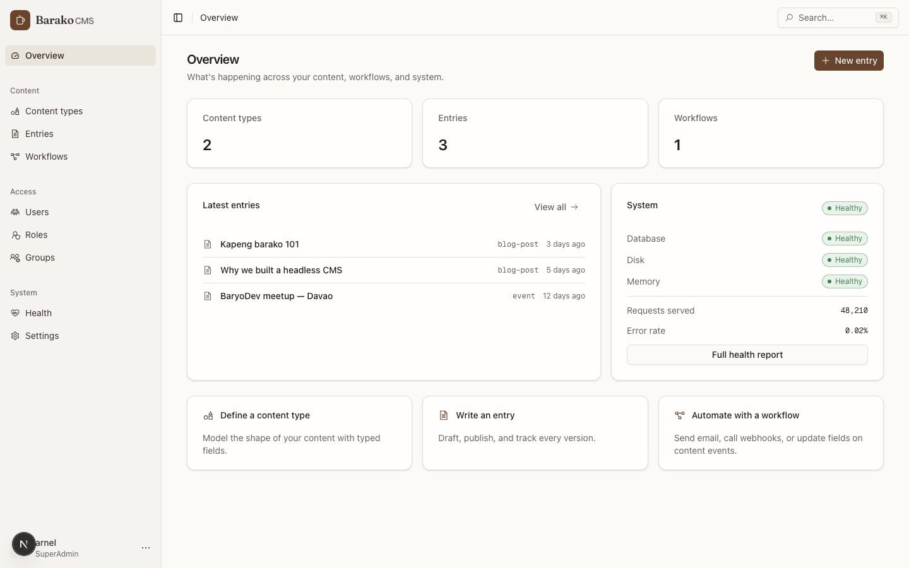
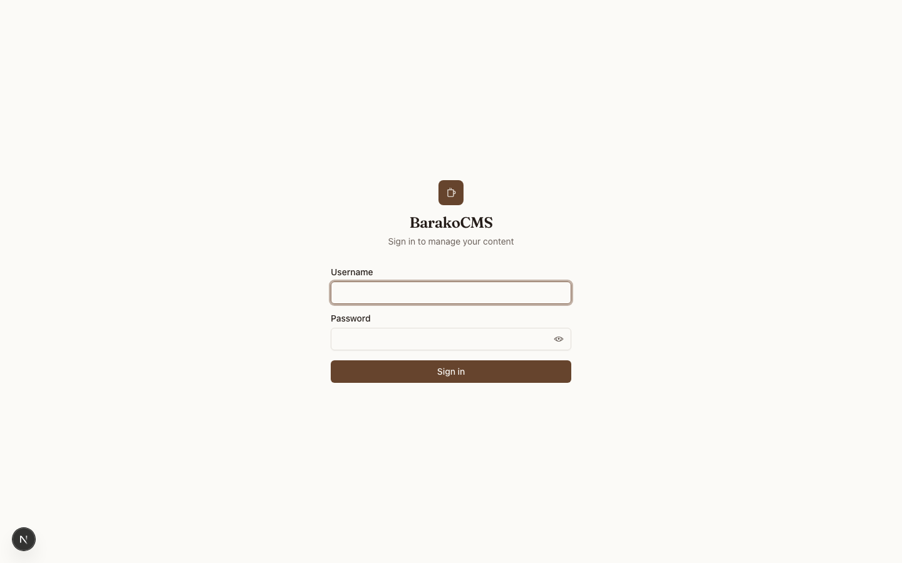
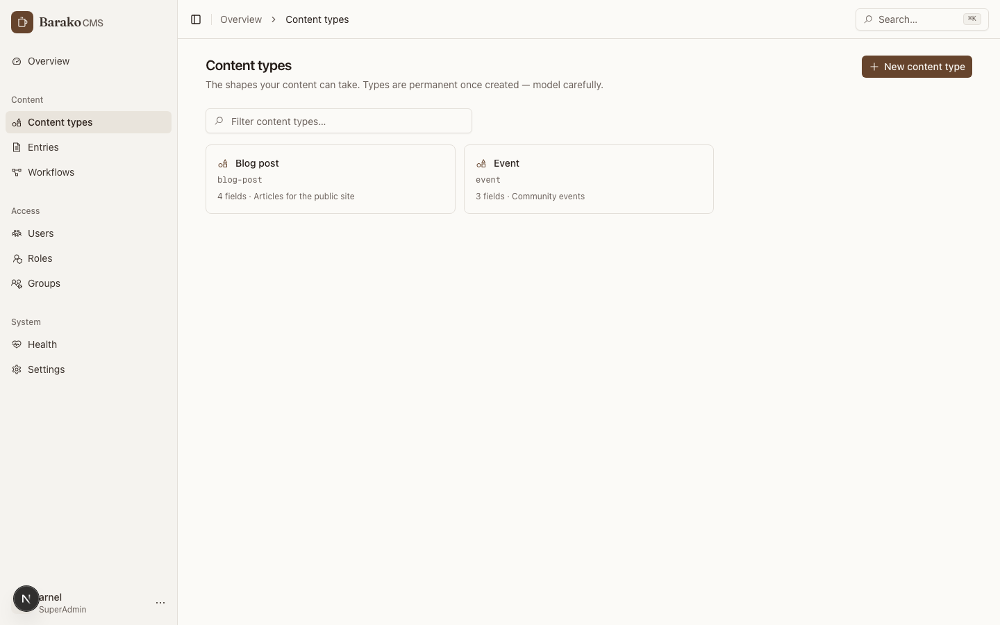
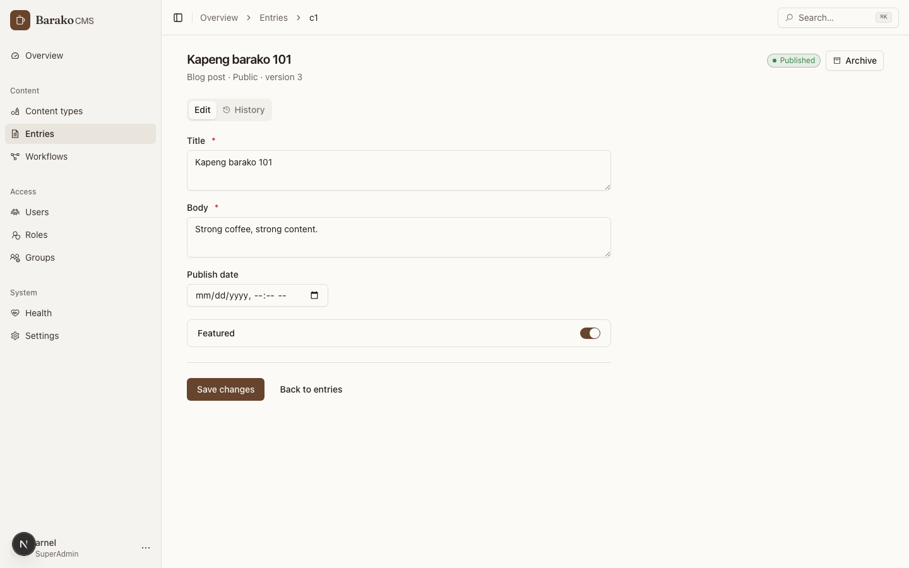
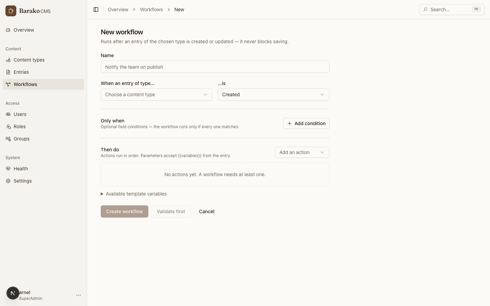
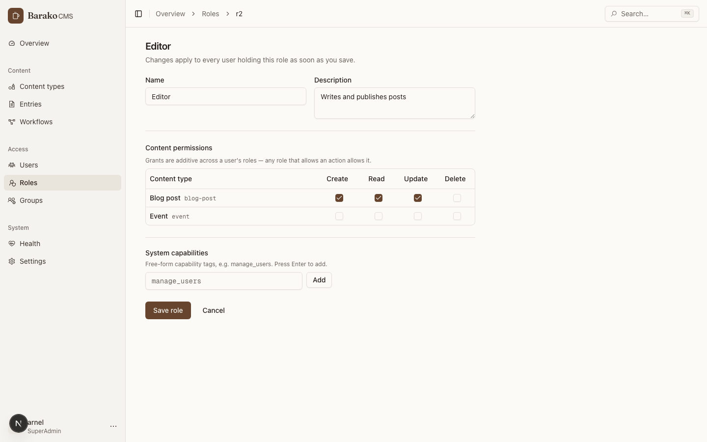

# BarakoCMS Admin UI

The admin dashboard for [BarakoCMS](https://github.com/BaryoDev/barakoCMS) — a minimalist, coffee-toned interface that covers every feature the headless CMS exposes.



## The fastest way to run it

Pull the prebuilt image from Docker Hub — no build step:

```bash
docker pull arnelirobles/barako-admin:latest
docker run -p 3000:3000 -e NEXT_PUBLIC_API_URL=http://localhost:5005 arnelirobles/barako-admin:latest
```

Or bring up the whole stack (API + PostgreSQL + admin) from the repo root:

```bash
docker compose -f docker-compose.hub.yml up -d
```

Then open <http://localhost:3000> and sign in with the initial admin account
(`InitialAdmin__Username` / `InitialAdmin__Password` on the API container).

`NEXT_PUBLIC_API_URL` is injected at **container start** by `entrypoint.sh` (it writes
`public/env-config.js`), so pointing the UI at a different API host never requires a rebuild.

## What it covers

| Area | Capabilities |
| --- | --- |
| Overview | Live stats, latest entries, health summary, quick actions |
| Content types | Browse, define with typed fields (`string`, `int`, `decimal`, `bool`, `datetime`, `array`, `object`) |
| Entries | Create, edit, publish, archive, filter by type, server-side pagination, **version history with rollback** |
| Workflows | Trigger-based builder (content type + Created/Updated), conditions, actions (Email, SMS, Webhook, CreateTask, UpdateField, Conditional), template variables, server-side validation, **dry-run simulation**, execution logs |
| Users | Assign and remove roles and groups inline, paginated |
| Roles | Full CRUD with a per-content-type Create/Read/Update/Delete permission matrix and system capabilities |
| Groups | Full CRUD plus member management |
| Settings | Runtime toggles grouped by category |
| Health | Live health checks, API traffic metrics, Kubernetes cluster status |

Session handling uses the API's rotating refresh tokens — the 15-minute access token renews
automatically, and a single in-flight refresh is shared across concurrent requests so the
backend's replay detection is never tripped.

## Screenshots

| | |
| --- | --- |
|  |  |
|  |  |
|  |  |

## Stack

- **Next.js 16** (App Router, React 19, standalone output for Docker)
- **shadcn/ui** on Tailwind CSS v4 — all colors flow through theme tokens in `src/app/globals.css` (warm paper light theme, roast dark theme; toggle in the sidebar account menu or ⌘K)
- **Icons**: [Line Awesome by Icons8](https://icons8.com/line-awesome), vendored as inline-SVG React components in `src/components/icons/` (regenerate with `node scripts/gen-icons.mjs`)
- **TanStack Query** for data fetching/caching, **axios** with auth + refresh interceptors in `src/lib/api.ts`
- **sonner** for toasts, **next-themes** for the theme switch, **⌘K command palette** for navigation and quick actions

## Local development

```bash
npm install
npm run dev        # http://localhost:3000, expects the API on http://localhost:5006
```

Set the API location with `NEXT_PUBLIC_API_URL` (build-time env or runtime `window._env_`).

```bash
npm run lint       # eslint (react-compiler rules enabled)
npm test           # vitest unit tests
npm run test:e2e   # playwright end-to-end tests
npm run build      # production build
```

## Project layout

```
src/
  app/(admin)/      # authenticated pages behind the sidebar shell
  app/login/        # sign-in
  components/ui/    # shadcn/ui primitives
  components/icons/ # generated Icons8 Line Awesome SVG components
  components/patterns/  # PageHeader, EmptyState, StatusBadge, ConfirmDialog, pagination
  hooks/            # TanStack Query hooks per feature area
  lib/api.ts        # axios client, token store, refresh rotation, pagination types
  types/            # API models mirroring the backend
```
