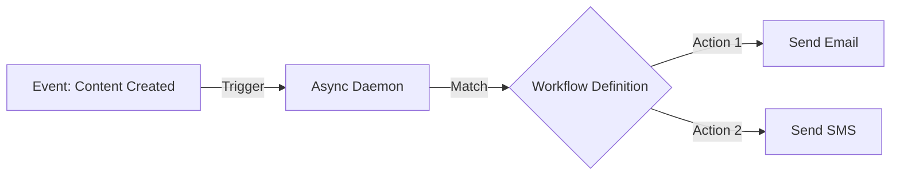

# Workflow Automation

BarakoCMS includes a powerful **Event-Driven Workflow Engine**.

## Concepts



## 1. Creating a Workflow

Workflows are defined via JSON.

```bash
POST /api/workflows
Authorization: Bearer {ADMIN_TOKEN}

{
  "name": "Onboarding Email",
  "triggerContentType": "Employee",
  "triggerEvent": "Created",
  "conditions": {
    "status": "Published"
  },
  "actions": [
    {
      "type": "SendEmail",
      "config": {
        "to": "{{data.Email}}",
        "subject": "Welcome {{data.Name}}",
        "body": "Your account is ready."
      }
    }
  ]
}
```

## 2. Template Variables

Inject dynamic data from the event into actions:

::: v-pre
| Variable         | Description                | Example          |
| :--------------- | :------------------------- | :--------------- |
| `{{data.Field}}` | Value from content payload | `{{data.Email}}` |
| `{{id}}`         | Content ID                 | `{{id}}`         |
| `{{status}}`     | Content Status             | `{{status}}`     |
:::

## 3. Supported Events

*   `Created`: New content added.
*   `Updated`: Existing content modified.
*   `StatusChanged`: Draft -> Published, etc.
*   `Deleted`: Soft deleted.

## 4. Troubleshooting Workflows

::: warning Delay
Workflows run in the background. Expect a 1-5 second delay after the API returns `200 OK`.
:::

*   **Check Logs**: The console outputs `[WorkflowEngine] Executing workflow...`.
*   **Check Conditions**: Ensure your `Conditions` match the content data exactly (case-sensitive values).
