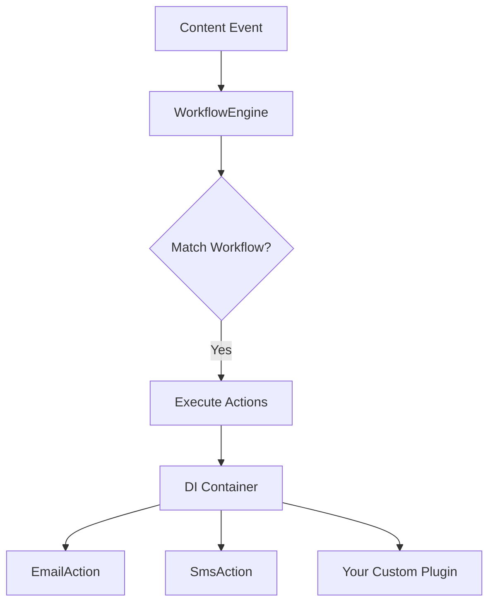

# Workflow Plugins

BarakoCMS **v2.0 Phase 2** introduces a **plugin-based architecture** for workflow actions, allowing developers to extend the workflow system without modifying core code.

## Architecture



## Creating a Custom Action Plugin

### 1. Implement `IWorkflowAction`

```csharp
using barakoCMS.Features.Workflows;
using barakoCMS.Models;

namespace YourApp.Workflows;

public class SlackAction : IWorkflowAction
{
    private readonly IHttpClientFactory _httpClientFactory;

    public SlackAction(IHttpClientFactory httpClientFactory)
    {
        _httpClientFactory = httpClientFactory;
    }

    // Must match the "Type" in workflow definitions
    public string Type => "Slack";

    public async Task ExecuteAsync(
        Dictionary<string, string> parameters, 
        Content content, 
        CancellationToken ct)
    {
        var webhookUrl = parameters.GetValueOrDefault("WebhookUrl");
        var message = parameters.GetValueOrDefault("Message", "Workflow triggered");

        var client = _httpClientFactory.CreateClient();
        await client.PostAsJsonAsync(webhookUrl, new { text = message }, ct);
    }
}
```

### 2. Register the Plugin

In your `Program.cs` or `Startup.cs`:

```csharp
services.AddScoped<IWorkflowAction, SlackAction>();
```

BarakoCMS will automatically discover and inject all `IWorkflowAction` implementations into the `WorkflowEngine`.

### 3. Use in Workflow Definitions

```json
{
  "name": "Notify Slack on New Content",
  "triggerContentType": "BlogPost",
  "triggerEvent": "Created",
  "conditions": {
    "status": "Published"
  },
  "actions": [
    {
      "type": "Slack",
      "parameters": {
        "WebhookUrl": "https://hooks.slack.com/services/YOUR/WEBHOOK/URL",
        "Message": "New blog post published: {{data.Title}}"
      }
    }
  ]
}
```

## Built-in Actions

BarakoCMS ships with the following workflow actions:

### Core Actions

*   **EmailAction** (`Type: "Email"`)
    *   Parameters: `To`, `Subject`, `Body`
    *   Sends emails via the configured email service

*   **SmsAction** (`Type: "SMS"`)
    *   Parameters: `To`, `Message`
    *   Sends SMS via the configured SMS service

*   **WebhookAction** (`Type: "Webhook"`)
    *   Parameters: `Url`
    *   Sends HTTP POST requests with content data to external webhooks
    *   Payload includes: `contentId`, `contentType`, `status`, `data`, `createdAt`, `updatedAt`

### Advanced Actions

*   **CreateTaskAction** (`Type: "CreateTask"`)
    *   Parameters: `ContentType`, `Status`, `Title`, `Data.*`
    *   Auto-generates new content items (tasks, tickets) from workflow triggers
    *   Tracks relationship to source content

*   **UpdateFieldAction** (`Type: "UpdateField"`)
    *   Parameters: `Field`, `Value`, `TargetId` (optional)
    *   Modifies fields on content (supports nested paths like `data.AssignedTo`)
    *   Can update triggering content or specify target by ID

*   **ConditionalAction** (`Type: "Conditional"`)
    *   Parameters: `Condition`, `ThenActions`, `ElseActions`
    *   Implements if/then/else logic for workflows
    *   Supports simple expressions: `{{data.Field}} == "Value"`, `{{status}} == "Published"`

## Action Examples

### Email Notification

```json
{
  "type": "Email",
  "parameters": {
    "To": "admin@example.com",
    "Subject": "New content created",
    "Body": "Content {{id}} was created."
  }
}
```

### Auto-Create Task

```json
{
  "type": "CreateTask",
  "parameters": {
    "ContentType": "Task",
    "Status": "Draft",
    "Title": "Review: {{data.Title}}",
    "Data.Priority": "High",
    "Data.AssignedTo": "team@example.com"
  }
}
```

### Update Content Field

```json
{
  "type": "UpdateField",
  "parameters": {
    "Field": "data.ReviewStatus",
    "Value": "PendingApproval"
  }
}
```

### Conditional Workflow

```json
{
  "type": "Conditional",
  "parameters": {
    "Condition": "{{data.Priority}} == \"High\"",
    "ThenActions": "[{\"Type\":\"Email\",\"Parameters\":{\"To\":\"urgent@example.com\",\"Subject\":\"High Priority Alert\"}}]",
    "ElseActions": "[{\"Type\":\"SMS\",\"Parameters\":{\"To\":\"+1234567890\",\"Message\":\"Normal priority item\"}}]"
  }
}
```

## Advanced: Template Variables

Action parameters support template variables using `{{variable}}` syntax:

| Variable             | Description             | Example           |
| -------------------- | ----------------------- | ----------------- |
| `{{id}}`             | Content ID              | `{{id}}`          |
| `{{contentType}}`    | Content type name       | `{{contentType}}` |
| `{{status}}`         | Content status          | `{{status}}`      |
| `{{data.FieldName}}` | Value from content data | `{{data.Email}}`  |

## Best Practices

1. **Dependency Injection**: Use constructor injection for services (e.g., `IHttpClientFactory`, `ILogger`)
2. **Error Handling**: Wrap risky operations in try-catch to prevent workflow failures
3. **Logging**: Log action execution for debugging
4. **Validation**: Validate required parameters in `ExecuteAsync`
5. **Async/Await**: Always use async operations for I/O-bound tasks

## Example: WebhookAction

```csharp
public class WebhookAction : IWorkflowAction
{
    private readonly IHttpClientFactory _httpClientFactory;
    private readonly ILogger<WebhookAction> _logger;

    public WebhookAction(IHttpClientFactory httpClientFactory, ILogger<WebhookAction> logger)
    {
        _httpClientFactory = httpClientFactory;
        _logger = logger;
    }

    public string Type => "Webhook";

    public async Task ExecuteAsync(
        Dictionary<string, string> parameters, 
        Content content, 
        CancellationToken ct)
    {
        var url = parameters.GetValueOrDefault("Url");
        if (string.IsNullOrEmpty(url))
        {
            _logger.LogWarning("Webhook URL not provided");
            return;
        }

        try
        {
            var client = _httpClientFactory.CreateClient();
            var payload = new
            {
                contentId = content.Id,
                contentType = content.ContentType,
                data = content.Data
            };

            await client.PostAsJsonAsync(url, payload, ct);
            _logger.LogInformation("Webhook sent to {Url}", url);
        }
        catch (Exception ex)
        {
            _logger.LogError(ex, "Failed to send webhook to {Url}", url);
        }
    }
}
```

## Future Enhancements

Phase 2 roadmap includes:
- **Plugin Auto-Discovery**: Automatically scan assemblies for `IWorkflowAction` implementations
- **Visual Workflow Builder**: Drag-and-drop UI for creating workflows
- **Plugin Marketplace**: Share and discover community-built action plugins
- **Enhanced Testing Tools**: Workflow debugging and testing utilities
